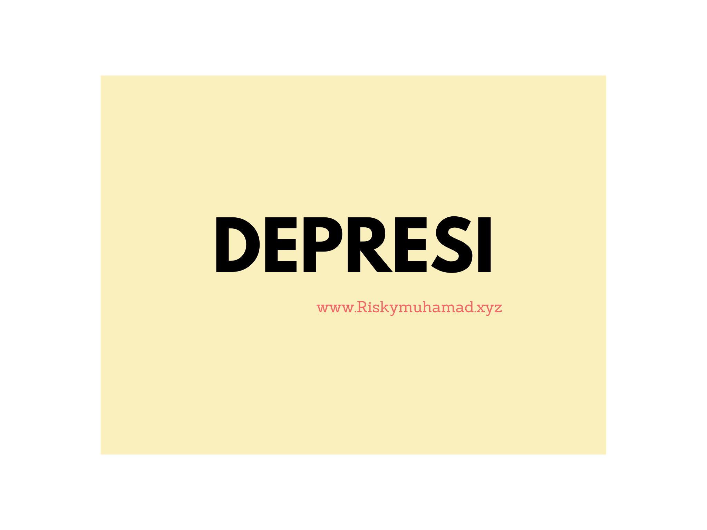

Diartikel perdana ini, Saya akan membahas masalah sosial yang cukup banyak terjadi di masyarakat Indonesia dari ekonomi rendah sampai tinggi dan usia muda sampai lanjut usia. Ketua Perhimpunan Dokter Spesialis Kedokteran Jiwa Indonesia (PDSKJI), dr Eka Viora, SpKJ, mengatakan untuk di Indonesia terdapat sekitar 15,6 juta penduduk yang mengalami depresi. Sayangnya hanya 8 persen yang mencari pengobatan ke profesional. Sebelumnya kita harus tahu dulu apa sih Depresi?

##Definisi

Menurut wikipedia :

> Depresi adalah suatu kondisi medis berupa perasaan sedih yang berdampak negatif terhadap pikiran, tindakan, perasaan, dan kesehatan mental seseorang.

##Penyebab

Lalu apa sih penyebab paling umum manusia mengalami Depresi, Saya ambil dari [kompas](https://lifestyle.kompas.com/read/2018/08/24/224147520/10-penyebab-depresi-yang-paling-umum)
Namun, tidak ada penyebab pasti dari depresi. Hal ini biasanya merupakan hasil dari kombinasi berbagai faktor kompleks yang meliputi: 

#####Faktor genetik. 

Coba kamu tanyakan kepada orang tua atau saudara apakah garis keturunan mu pernah ada yang mengalami depresi. Karena Memiliki keturunan pengidap depresi dapat meningkatkan risiko seseorang mengalami depresi. 

#####Faktor biologis. 

Depresi bisa terjadi akibat kadar serotonin dalam otak yang tidak mencukupi. Kondisi ini dikenal sebagai depresi klinis.
 
#####Jenis kelamin wanita. 

Wanita dua kali lipat lebih mudah kena depresi karena perubahan hormon yang terjadi selama hidupnya. Seperti saat menstruasi (PMDD), kehamilan, melahirkan (depresi pascamelahirkan), dan perimenopause. Biasanya, risiko depresi pada wanita akan menurun setelah lewat usia menopause. 

#####Pola makan buruk. 

Kekurangan vitamin dan mineral tertentu dapat memicu gejala depresi. 

#####Mengidap penyakit fisik kronis.

Penyakit yang dirasa cukup lama dan kronis yang tak kunjung sembuh, juga dapat menjadi penyebab depresi.

#####Trauma psikis.

kejadian yang terjadi saat masa kanak-kanak, seperti pelecehan seksual, kehilangan orangtua, atau perceraian orangtua. 

#####Penyalahgunaan obat. 

Obat-obatan dan alkohol dapat memicu depresi. Bukan cuma golongan narkoba, tapi juga obat resep. Beberapa obat resep yang terkait dengan gejala depresi termasuk antikonvulsan, statin, stimulan, benzodiazepine, kortikosteroid, dan beta-blocker. 

#####Stres berat dan kronis. 

Para peneliti menduga kadar hormon kortisol yang terus-terusan tinggi dapat menekan kadar serotonin dan akhirnya memicu gejala depresi. 

#####Memendam emosi. 

Memendam emosi setelah kehilangan orang yang dicintai atau dikhianati bisa membuat seseorang menjadi depresi. Faktor lingkungan, misalnya lingkungan pekerjaan. Stres di kantor terkadang juga bisa memicu munculnya depresi.

>Apabila kamu merasa memiliki gejala depresi, jangan melakukan self-diagnose dan segera pergi ke psikolog, ya!

##Mencegah

kali ini saya akan mebagikan cara agar kita terhindar dari depresi secara mudah yang saya rangkum dari [idntimes](www.idntimes.com):.


```terminal
1. Jangan biarkan dirimu sendirian
2. Menekuni Hobi yang disukai
3. Makan, Minum, Tidur yang cukup
4. Berolahraga untuk membuat suasana hati lebih baik
5. Konsumsi makanan yang membuat mood membaik
6. Singkirkan pikiran-pikiran negatif
7. Menanamkan kata -kata positif
```

##Opini

Apakah kamu pernah mendengar bahwa orang dengan kelainan mental adalah karena lemahnya iman seseorang?

Dikarenakan saya bukan orang yang berlatar dari psikolog saya mengutip kalimat [Dr. Jiemi Ardian](https://twitter.com/jiemiardian/status/984432486775013376?s=20) yang sesuai dengan opini saya pribadi :
>Depresi bukan tanda lemahnya iman
Depresi tanda lemahnya dukungan sosial kita pada orang dengan depresi
Depresi bukan tanda jiwa yang lemah
Depresi tanda perhatian dan kasih sayang lingkungan lah yang lemah

Namun bukan berarti hubungan dengan tuhan menjadi tidak penting.
